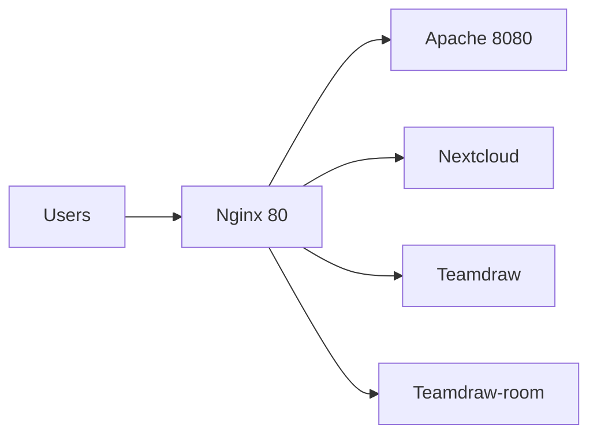

<div align="center" style="display:flex;flex-direction:column;">
  <h3>This project has been private forked from https://github.com/excalidraw/excalidraw</h3>
</div>

## Try it now

Go to https://excalidraw.com to start sketching.

Read their [blog](https://blog.excalidraw.com) and follow the [guides](https://howto.excalidraw.com) to learn more about Excalidraw and how to use it effectively.

## Run the code

### Local Installation

These instructions will get you a copy of the project up and running on your local machine for development and testing purposes.

#### Clone the repo

```sh
git clone git@gitlab.iwa.fi:teammeet/teamdraw.git
```

#### Commands

| Command               | Description                       |
| --------------------- | --------------------------------- |
| `npm install`         | Install the dependencies          |
| `npm start`           | Run the project                   |
| `npm run fix`         | Reformat all files with Prettier  |
| `npm test`            | Run tests                         |
| `npm run test:update` | Update test snapshots             |
| `npm run test:code`   | Test for formatting with Prettier |

#### Docker Compose

You can use docker-compose to work on teamdraw locally if you don't want to setup a Node.js env.

```sh
docker-compose up --build -d
```

## Teamdraw is built using these awesome tools

- [React](https://reactjs.org)
- [Rough.js](https://roughjs.com)
- [TypeScript](https://www.typescriptlang.org)

## Development Server

```sh
ssh -v ubuntu@10.200.200.127
```

### EC2 Instance

Private IP: 10.200.200.127

Public IP: 13.49.113.99

### Server Architecture



### Teamdraw-room dev server (Websocket server)

https://teamdraw-room.herokuapp.com

### Nextcloud dev server

http://13.49.113.99/nextcloud/index.php

## Deployment

TBD

## Source code structure break down

### Drawing events

All events can be found in /src/components/App.tsx

- onPointerMoveFromPointerDownHandler

- onPointerUpFromPointerDownHandler

### Execute an action

MainApp imports actions

MainApp imports actionManager

MainApp execute an action through actionManager by

```js
this.actionManager.executeAction(<ActionComponent>);
```

### Colors

Color config can be found in /src/colors.ts file.

Basically, Excalidraw is using open-source color scheme from [open-color](https://yeun.github.io/open-color/)

### Element customization

Rendering element could be found in `renderer/renderElement.ts` file

generateElementShape function
